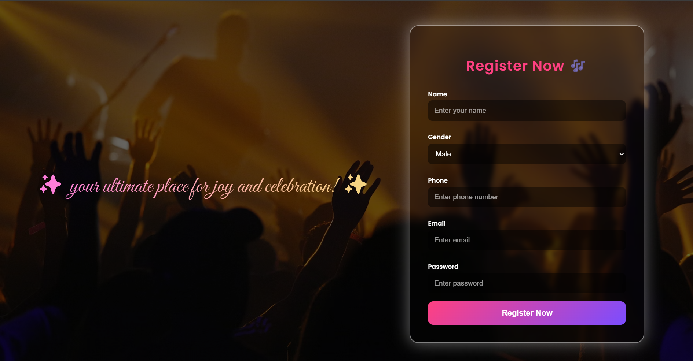
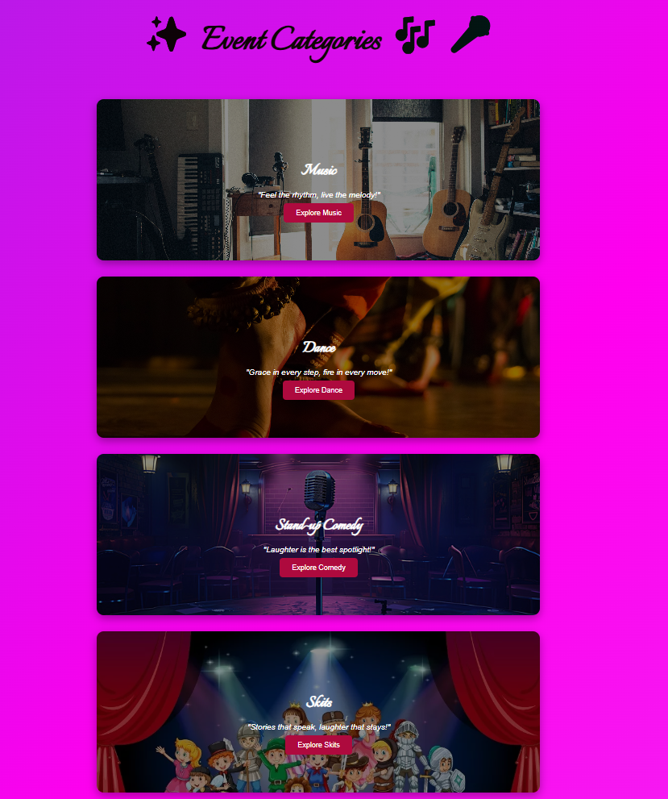
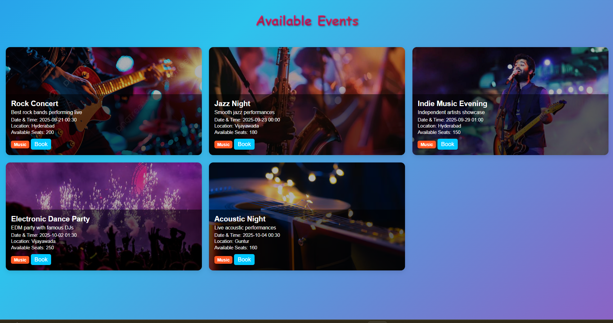
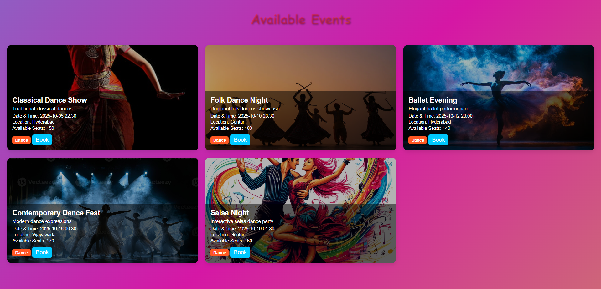
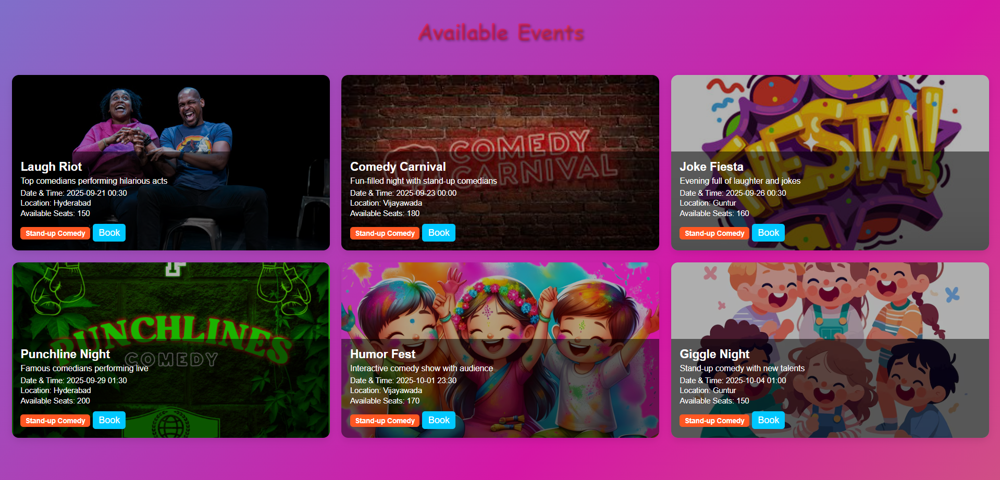
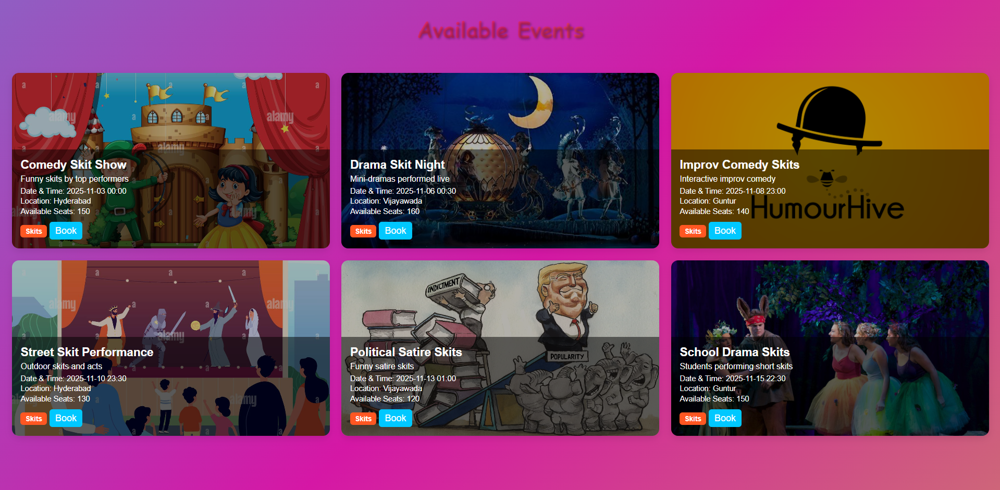
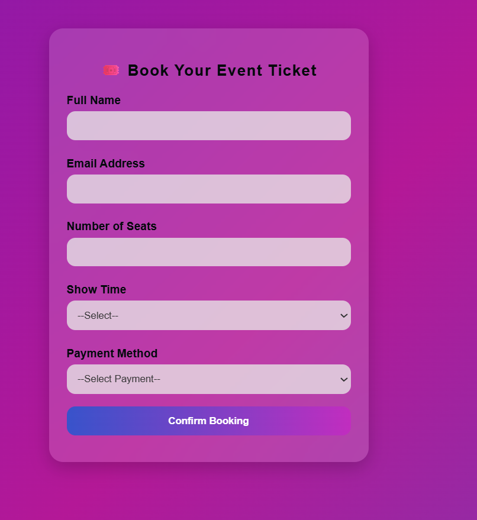
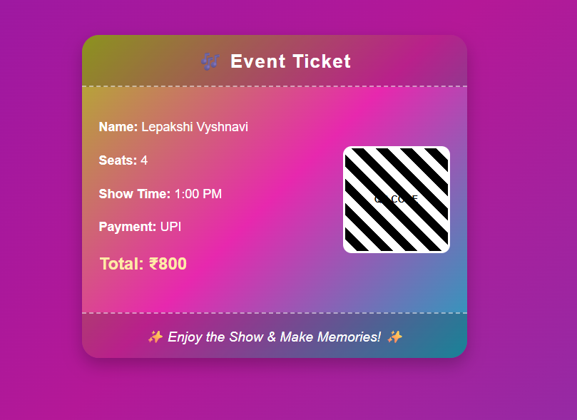

# Event Management System 

## Overview
A full-stack web application developed using Spring Boot that enables users to register, browse categorized events, and book events seamlessly. The system integrates with MySQL for persistent data storage and follows a structured layered architecture.

## Features
- User Registration
- Event Creation & Listing
- Event Categorization
- Event Booking System
- Notification Management
- Image Support for Events
- MySQL Database Integration

## Technologies Used
- Java
- Spring Boot
- Spring Data JPA
- Thymeleaf
- MySQL
- HTML, CSS
- Maven

## Project Structure
src/
 ├── main/
 │   ├── java/com/example/event/app
 │   ├── resources/templates
 │   ├── resources/static
 │   └── application.properties
 └── test/

## Architecture
The application follows a layered structure:

- **Controller Layer** – Handles HTTP requests
- **Repository Layer** – Performs database operations using JPA
- **Entity Layer** – User, Event, Booking, Category, Notification models
- **Template Layer** – Thymeleaf HTML templates

## Database Design

### Entities
- User
- Event
- Booking
- Category
- Notification

### Relationships
- One User → Many Bookings
- One Event → Many Bookings
- One Category → Many Events

##  Key Concepts Implemented
- CRUD Operations
- Form Handling
- Entity Mapping using JPA
- Layered Architecture
- Database Connectivity with MySQL

## ▶ How to Run
1. Clone the repository  
2. Configure MySQL credentials in `application.properties`  
3. Run the application: mvn spring-boot:run

4. Open browser:
http://localhost:9090

## 📸 Screenshots

### 📝 Registration Page

---

### 📂 Event Categories

---

### 🎵 Music Category

---

### 💃 Dance Category

---

### 🎭 Standup Comedy Category

---

### 🎬 Skit Category

---

### 🎟 Booking Event

---

### 🧾 Event Ticket

## Author
Lepakshi Vyshnavi  
Integrated M-tech-CSE | VIT-AP University
